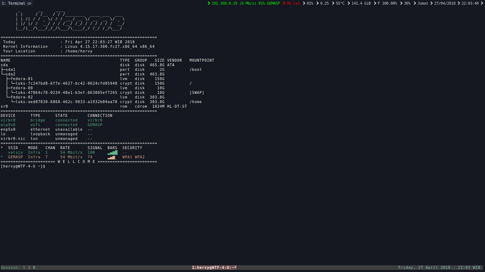

## ===============================================================
<h1 align="center">For Fedora and Centos linux</h1>
## ===============================================================
# 
# 
## ===============================================================
<h1 align="center">Details >></h1>

| Item | Value |
| :--- | :---- |
| OS | Fedora 27 (Server Edition) or Centos 7 |
| Fav WM(s) | i3 |
| Fav DM(s) | sddm |
| Shell | bash |
| Font | Sans 8 |
| Terminal | URxvt|
| Launcher | dmenu |
| Bar | i3bar |
| Wallpaper | nitrogen |
| Lock Screen | i3lock|
| Logout / Shutdown | i3bar |
| Volume Control | alsamixer |
| Brightness Controller | xbacklight |
| Network Applet | nmtui |
| Bluetooth Applet | blueberry |
| Text Editor | vim, nvim + tmux |

## ===============================================================
<h1 align="center">Step 1 >></h1>
## Fedora update:
$ fu
## Centos update:
$ cu
## ===============================================================
<h1 align="center">Step 2 >></h1>
## Install RPMFusion for fedora
$ rff
## Install RPMFusion for centos
$ rfc
## ===============================================================
<h1 align="center">Step 3 (Optional, only centos) >></h1>
## Install Epel repo
$ epel
## Install Nux-dextop repo
$ nux
## Install Remi repo
$ remi
## ===============================================================
<h1 align="center">Step 4 >></h1>
## Install basic for fedora
$ bf
## Install basic for centos
$ bc
## ===============================================================
<h1 align="center">Step 5 (optional, GUI apps : firefox, gimp, inkscape, etc) >></h1>
## Install basic for fedora (GUI APP)
$ bf2
## Install basic for centos (GUI APP)
$ bc2
## ===============================================================
<h1 align="center">Step 6 >></h1>
## Install codec for fedora
$ cf
## Install codec for centos
$ cc
## ===============================================================
<h1 align="center">Step 7 (Optional) >></h1>
## Install i3-wm for fedora
$ i3f
## Install i3-wm for centos
$ i3c
## ===============================================================
<h1 align="center">Step 8 (Optional) >></h1>
## Install web server basic for fedora
$ wf
## Install web server basic for centos
$ wc
## ===============================================================

<h1 align="center">Etc. >></h1>
## ===============================================================
## Fedora install, ex install gimp >>
$ fi gimp
## Centos install, ex install gimp >>
$ ci gimp 
## ===============================================================
## Fedora remove, ex install gimp >>
$ fr gimp
## Centos remove, ex install gimp >>
$ cr gimp
## ===============================================================
## Fedora search, ex install gimp >>
$ fs gimp
## Centos search, ex install gimp >>
$ cs gimp
## ===============================================================
## Fedora clean
$ fx
## Centos clean
$ cx
## ===============================================================
## open config .basrc at ~ (more info alias)
$ vimbr
## ===============================================================
## open config .Xresource at ~
$ vimxr
## ===============================================================
## open config i3 at ~/.i3/
$ vimi3
## ===============================================================
## open config i3status at ~/.i3/
$ vimi3st
## ===============================================================
## Console tty to GUI
$ gui
## ===============================================================
